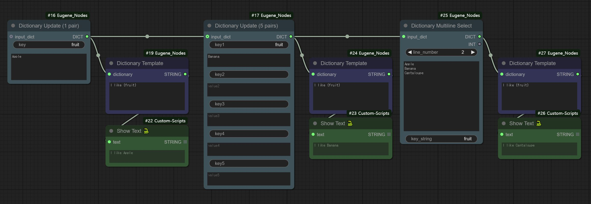
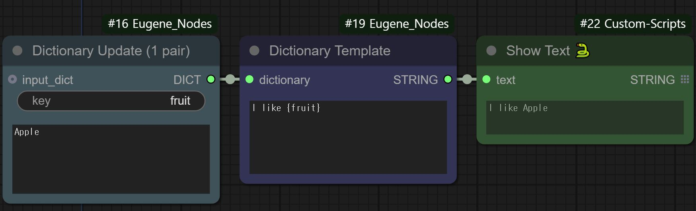
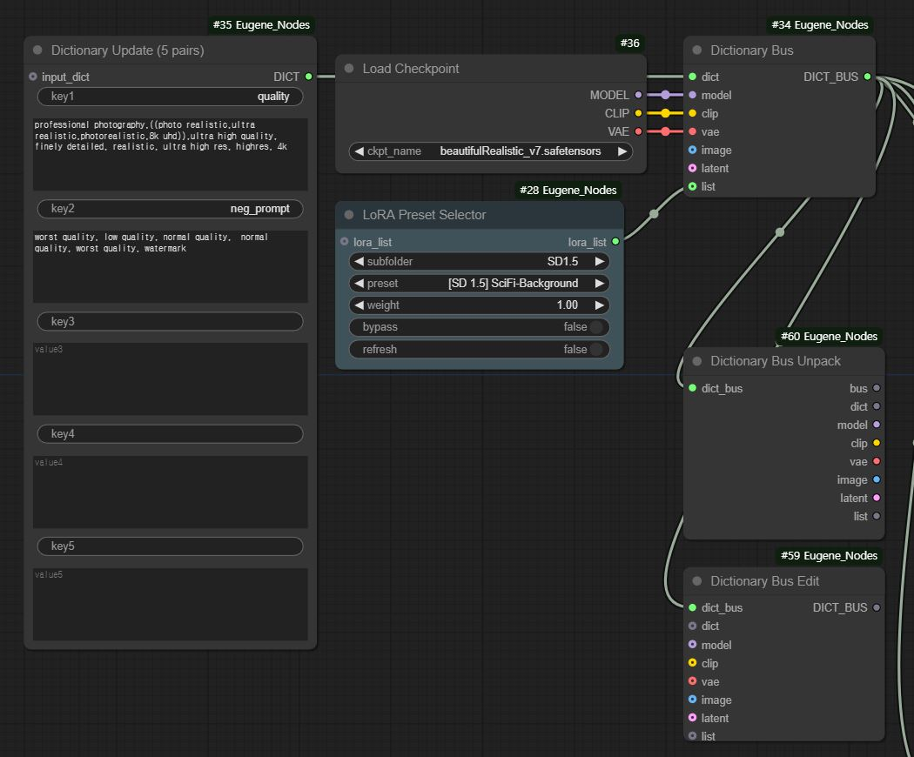
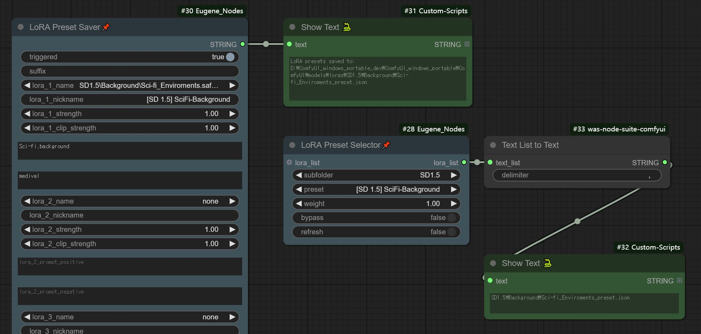
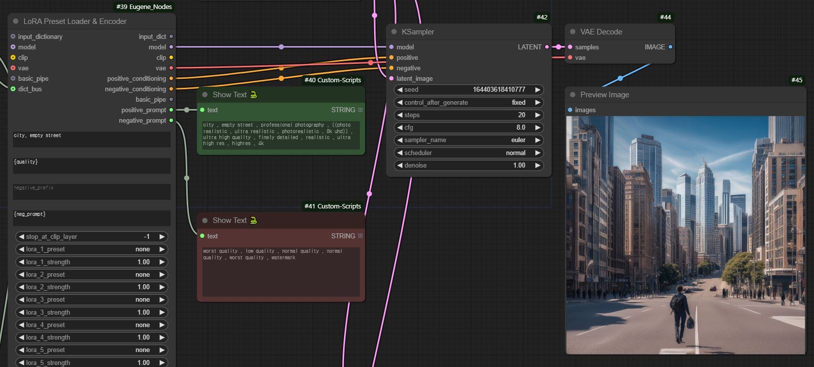
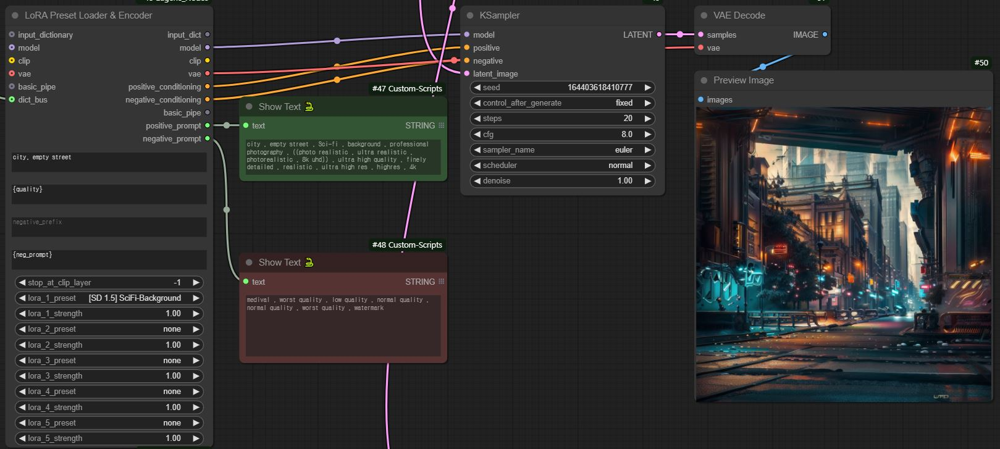
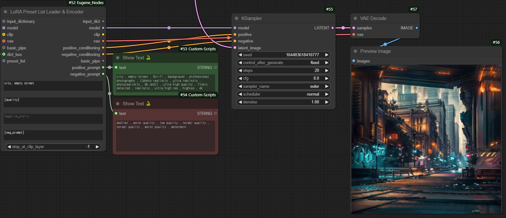

# Eugene's ComfyUI Custom Utility Nodes

ComfyUI 워크플로우를 최적화하고 관리하기 위한 유틸리티 노드 모음입니다.

## Dictionary Based Prompt Management
Python Dictionary를 활용하여 프롬프트 텍스트를 체계적으로 관리하고 재사용할 수 있는 유틸리티 노드들을 제공합니다.

### Dictionary Nodes



- DictUpdate1
  - 단일 key-value 쌍을 dictionary에 추가/업데이트
  - 입력 dictionary가 없는 경우 새로운 dictionary 생성
  - 빈 key 또는 value는 무시됨

- DictUpdate5
  - 최대 5개의 key-value 쌍을 동시에 추가/업데이트 
  - 입력 dictionary가 없는 경우 새로운 dictionary 생성
  - 빈 key 또는 value는 자동으로 무시됨
  - 모든 필드는 선택적(optional)으로 사용 가능

- DictUpdate10
  - 최대 10개의 key-value 쌍을 동시에 추가/업데이트
  - 입력 dictionary가 없는 경우 새로운 dictionary 생성
  - 빈 key 또는 value는 자동으로 무시됨
  - 모든 필드는 선택적(optional)으로 사용 가능

- DictTemplate
  - Dictionary의 값들을 템플릿 텍스트에 적용
  - 멀티라인 텍스트 지원
  - 문법: {key} 형식으로 placeholder 지정
  - 
  - 예시:


- DictMultilineSelect
  - 멀티라인 텍스트에서 특정 라인을 선택하여 dictionary에 추가
  - 입력:
    - 기존 dictionary
    - 선택할 라인 번호
    - 멀티라인 텍스트
    - 새로운 key 문자열
  - 출력: 업데이트된 dictionary와 선택된 라인 번호

### Dictionary Bus Nodes

Dictionary와 모델 컴포넌트들(MODEL, CLIP, VAE 등)을 함께 관리하기 위한 유틸리티 노드들입니다.

- DictBus
  - Dictionary와 모델 컴포넌트들을 하나의 번들로 묶음
  - 필수 입력: dictionary, model, clip, vae
  - 선택 입력: image, latent
  - 워크플로우에서 여러 컴포넌트를 단일 연결로 전달 가능

- DictBusUnpack
  - DictBus 번들을 개별 컴포넌트로 분리
  - 모든 컴포넌트(dictionary, model, clip, vae, image, latent)를 개별적으로 출력
  - 원본 bus도 함께 출력되어 계속 사용 가능

- DictBusEdit
  - DictBus 번들의 특정 컴포넌트만 선택적으로 수정
  - 수정하지 않은 컴포넌트는 원본 값 유지
  - 워크플로우 중간에 필요한 컴포넌트만 업데이트 가능

## LoRA Preset Management
LoRA 모델과 프롬프트를 프리셋으로 관리하고 적용하기 위한 노드들입니다.

### Preset Management Nodes

- LoraPresetSaver
  - 최대 5개의 LoRA 설정을 프리셋 파일로 저장
  - 각 LoRA에 대해 설정 가능한 항목:
    - LoRA 모델 선택
    - 강도 (strength) 설정
    - CLIP 강도 설정
    - 긍정/부정 프롬프트
    - 별칭(nickname) 지정
  - 저장된 프리셋은 JSON 형식으로 저장됨

- LoraPresetSelector
  - 저장된 LoRA 프리셋을 선택하고 리스트로 관리
  - 서브폴더 기반 프리셋 구조 지원
  - 실시간 프리셋 새로고침 기능
  - 웹 인터페이스를 통한 동적 프리셋 관리
  - 바이패스 옵션으로 선택적 적용
  - 선택된 프리셋들을 리스트로 관리

### LoRA Loader Nodes


- LoraLoader (Advanced Loader)
  - 최대 5개의 LoRA 프리셋을 동시에 적용
  - 각 LoRA의 강도를 개별적으로 조정
  - 프롬프트 프리픽스/서픽스 지원
  - Dictionary 기반 프롬프트 템플릿 지원
  - CLIP 레이어 조정 가능
  - Dictionary Bus 및 Basic Pipe 호환


- LoraListLoader (List Based Loader)
  - PresetSelector의 출력 리스트를 직접 사용
  - 여러 LoRA를 순차적으로 적용
  - 프리셋에 저장된 설정값 사용
  - Dictionary Bus 및 Basic Pipe 호환
  - 프롬프트 프리픽스/서픽스 지원


## 설치 방법
1. ComfyUI의 `custom_nodes` 디렉토리에 이 저장소를 클론합니다.
2. ComfyUI를 재시작합니다.


## 기타 정보 
### Web Interface
LoRA 프리셋 관리를 위한 웹 API 엔드포인트를 제공합니다:
- `/lora_presets`: 현재 사용 가능한 모든 프리셋 정보 조회
- `/lora_presets/refresh`: 프리셋 목록 강제 새로고침

### 프리셋 디렉토리 구조
프리셋은 LoRA 폴더 내에서 다음과 같은 구조로 관리됩니다:
```
loras/
├── preset1_preset.json
├── category1/
│   ├── preset2_preset.json
│   └── preset3_preset.json
└── category2/
    └── preset4_preset.json
```

### 프리셋 파일 구조
```json
{
    "lora_name": "model_name.safetensors",
    "lora_path": "/path/to/lora",
    "strength": 1.0,
    "clip_strength": 1.0,
    "prompt_positive": "positive prompt text",
    "prompt_negative": "negative prompt text",
    "nickname": "Display Name"
}
```

## 사용 예시
[여기에 주요 사용 사례와 워크플로우 예시를 추가할 수 있습니다]